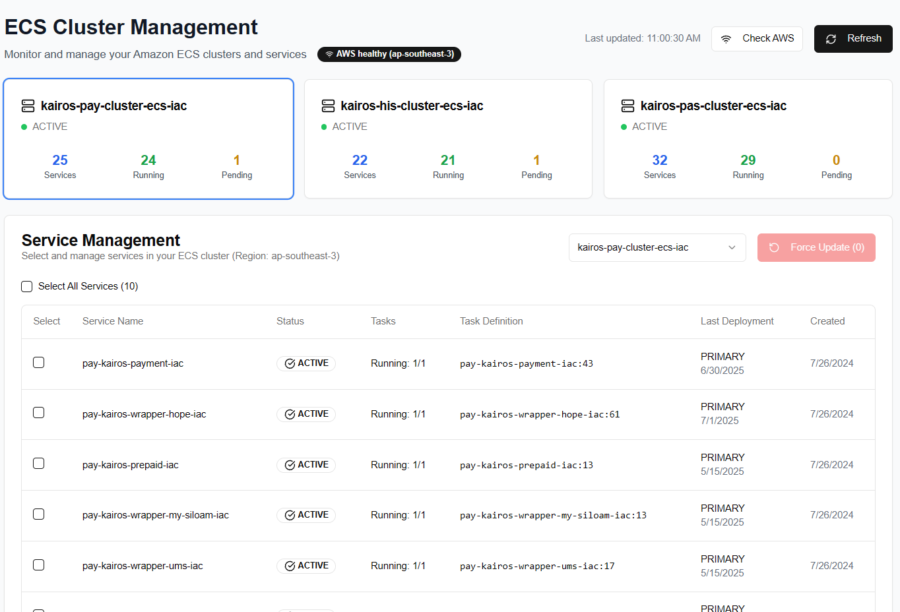

<div align="center">

# 🚀 ECS Cluster Management Dashboard

[](https://nextjs.org/)
[](https://www.typescriptlang.org/)
[](https://aws.amazon.com/sdk-for-javascript/)
[](https://tailwindcss.com/)
[](https://opensource.org/licenses/MIT)

**A modern, responsive web application for monitoring and managing Amazon ECS clusters and services**

[Features](#-features) • [Installation](#-installation) • [Usage](#-usage) • [Configuration](#-configuration) • [API](#-api-endpoints) • [Contributing](#-contributing)

</div>

---

## 📋 Table of Contents

- [Overview](#-overview)
- [Features](#-features)
- [Technologies Used](#-technologies-used)
- [Prerequisites](#-prerequisites)
- [Installation](#-installation)
- [Configuration](#-configuration)
- [Usage](#-usage)
- [API Endpoints](#-api-endpoints)
- [Project Structure](#-project-structure)
- [Contributing](#-contributing)
- [Troubleshooting](#-troubleshooting)
- [License](#-license)
- [Support](#-support)

---

## 🎯 Overview

The **ECS Cluster Management Dashboard** is a comprehensive web application built with Next.js that provides real-time monitoring and management capabilities for Amazon Elastic Container Service (ECS) clusters. It offers an intuitive interface to view cluster status, manage services, and perform deployment operations across multiple ECS clusters.

### 🎨 Key Highlights

- **Real-time Monitoring**: Live status updates for clusters and services
- **Multi-cluster Support**: Manage multiple ECS clusters from a single dashboard
- **Service Management**: Select and perform bulk operations on ECS services
- **Force Deployments**: Trigger new deployments with a single click
- **Responsive Design**: Works seamlessly on desktop and mobile devices
- **AWS Integration**: Native AWS SDK integration with proper credential handling

---

## 📸 Screenshot



*The main dashboard interface showing cluster status, service management, and deployment controls*

---

## ✨ Features

### 🖥️ Dashboard Features
- **📊 Cluster Overview**: Visual cards showing cluster status, active services, and task counts
- **📋 Service Table**: Detailed table with service information, status, and deployment history
- **🔄 Real-time Updates**: Auto-refresh functionality with manual refresh options
- **🎯 Service Selection**: Individual and bulk service selection with checkboxes
- **⚡ Force Updates**: Trigger force deployments for selected services
- **🔍 Health Monitoring**: AWS connection health checks and status indicators

### 🛠️ Management Features
- **🚀 Bulk Operations**: Perform operations on multiple services simultaneously
- **📈 Status Tracking**: Visual status indicators for services and deployments
- **🔔 Error Handling**: Comprehensive error handling with user-friendly messages
- **📱 Responsive UI**: Mobile-friendly interface with adaptive layouts
- **🎨 Modern Design**: Clean, professional interface using shadcn/ui components

### 🔒 Security Features
- **🔐 Secure Credentials**: Environment variable-based AWS credential management
- **🛡️ Error Boundaries**: Graceful error handling and recovery
- **🔍 Input Validation**: Proper validation for all user inputs and API calls

---

## 🛠️ Technologies Used

### Frontend
- **[Next.js 14](https://nextjs.org/)** - React framework with App Router
- **[TypeScript](https://www.typescriptlang.org/)** - Type-safe JavaScript
- **[Tailwind CSS](https://tailwindcss.com/)** - Utility-first CSS framework
- **[shadcn/ui](https://ui.shadcn.com/)** - Modern React component library
- **[Lucide React](https://lucide.dev/)** - Beautiful & consistent icons

### Backend & AWS
- **[AWS SDK for JavaScript v3](https://aws.amazon.com/sdk-for-javascript/)** - AWS service integration
- **[Amazon ECS](https://aws.amazon.com/ecs/)** - Container orchestration service
- **Node.js Runtime** - Server-side JavaScript execution

### Development Tools
- **[ESLint](https://eslint.org/)** - Code linting and formatting
- **[Prettier](https://prettier.io/)** - Code formatting
- **[Git](https://git-scm.com/)** - Version control

---

## 📋 Prerequisites

Before you begin, ensure you have the following installed:

- **Node.js** (version 18.0 or higher)
- **npm** or **yarn** package manager
- **AWS CLI** configured with appropriate credentials
- **Git** for version control

### AWS Requirements
- AWS account with ECS access
- IAM user/role with the following permissions:
  - `ecs:DescribeClusters`
  - `ecs:ListServices`
  - `ecs:DescribeServices`
  - `ecs:UpdateService`

---

## 🚀 Installation

### 1. Clone the Repository

```bash
git clone https://github.com/lutfi-zain/ecs-dashboard.git
cd ecs-dashboard
```

### 2. Install Dependencies

```bash
npm install
# or
yarn install
```

### 3. Environment Configuration

Create a `.env.local` file in the root directory:

```env
# AWS Configuration
AWS_ACCESS_KEY_ID=your_aws_access_key_id
AWS_SECRET_ACCESS_KEY=your_aws_secret_access_key
AWS_REGION=ap-southeast-3

# Optional: Custom cluster names (comma-separated)
ECS_CLUSTER_NAMES=kairos-pay-cluster-ecs-iac,kairos-his-cluster-ecs-iac,kairos-pas-cluster-ecs-iac
```

### 4. Start Development Server

```bash
npm run dev
# or
yarn dev
```

The application will be available at `http://localhost:3000`

---

## ⚙️ Configuration

### Environment Variables

| Variable | Description | Required | Default |
|----------|-------------|----------|---------|
| `AWS_ACCESS_KEY_ID` | AWS access key ID | ✅ | - |
| `AWS_SECRET_ACCESS_KEY` | AWS secret access key | ✅ | - |
| `AWS_REGION` | AWS region | ✅ | `ap-southeast-3` |
| `ECS_CLUSTER_NAMES` | Comma-separated cluster names | ❌ | Predefined clusters |

### Cluster Configuration

By default, the application monitors these clusters:
- `kairos-pay-cluster-ecs-iac`
- `kairos-his-cluster-ecs-iac`
- `kairos-pas-cluster-ecs-iac`

To modify the clusters, update the `clusterNames` array in `app/api/ecs-status/route.ts`:

```typescript
const clusterNames = [
  "your-cluster-1",
  "your-cluster-2",
  "your-cluster-3"
]
```

---

## 📖 Usage

### 1. Dashboard Overview

Upon loading, the dashboard displays:
- **Cluster Cards**: Overview of each cluster's status and metrics
- **AWS Health Status**: Connection status indicator
- **Last Updated**: Timestamp of the most recent data refresh

### 2. Cluster Selection

- Click on any cluster card to select it
- Use the dropdown menu for cluster selection
- Selected cluster is highlighted with a blue border

### 3. Service Management

- View detailed service information in the table
- Use checkboxes to select individual services
- Use "Select All" to select all services in a cluster

### 4. Force Updates

1. Select one or more services using checkboxes
2. Click the "Force Update" button
3. Monitor the progress with loading indicators
4. View results in the success/error messages

### 5. Monitoring

- Use the "Refresh" button to update data manually
- Check AWS connection status with "Check AWS" button
- Monitor real-time status changes and deployment progress

---

## 🔌 API Endpoints

### GET `/api/ecs-status`

Retrieves status information for all configured ECS clusters.

**Response:**
```json
[
  {
    "clusterName": "kairos-pay-cluster-ecs-iac",
    "status": "ACTIVE",
    "activeServicesCount": 5,
    "runningTasksCount": 10,
    "pendingTasksCount": 0,
    "services": [
      {
        "serviceName": "my-service",
        "status": "ACTIVE",
        "runningCount": 2,
        "desiredCount": 2,
        "taskDefinition": "my-task:1"
      }
    ]
  }
]
```

### POST `/api/ecs-force-update`

Triggers force deployment for selected services.

**Request Body:**
```json
{
  "clusterName": "kairos-pay-cluster-ecs-iac",
  "serviceNames": ["service-1", "service-2"]
}
```

**Response:**
```json
[
  {
    "serviceName": "service-1",
    "success": true,
    "message": "Force deployment initiated successfully"
  }
]
```

### GET `/api/aws-health`

Checks AWS connection health and credentials.

**Response:**
```json
{
  "status": "healthy",
  "message": "AWS connection successful",
  "region": "ap-southeast-3",
  "timestamp": "2024-01-15T10:30:00.000Z"
}
```

---

## 📁 Project Structure

```
ecs-dashboard/
├── app/
│   ├── api/
│   │   ├── aws-health/
│   │   │   └── route.ts
│   │   ├── ecs-force-update/
│   │   │   └── route.ts
│   │   └── ecs-status/
│   │       └── route.ts
│   ├── globals.css
│   ├── layout.tsx
│   └── page.tsx
├── components/
│   └── ui/
│       ├── alert.tsx
│       ├── badge.tsx
│       ├── button.tsx
│       ├── card.tsx
│       ├── checkbox.tsx
│       ├── select.tsx
│       ├── skeleton.tsx
│       └── table.tsx
├── lib/
│   ├── aws-config.ts
│   └── utils.ts
├── .env.local
├── .gitignore
├── next.config.js
├── package.json
├── README.md
├── tailwind.config.js
└── tsconfig.json
```

---

## 🤝 Contributing

We welcome contributions to improve the ECS Dashboard! Here's how you can help:

### Getting Started

1. **Fork the repository**
2. **Create a feature branch**: `git checkout -b feature/amazing-feature`
3. **Make your changes**
4. **Run tests**: `npm test`
5. **Commit your changes**: `git commit -m 'Add amazing feature'`
6. **Push to the branch**: `git push origin feature/amazing-feature`
7. **Open a Pull Request**

### Development Guidelines

- Follow TypeScript best practices
- Use meaningful commit messages
- Add tests for new features
- Update documentation as needed
- Follow the existing code style

### Code Style

- Use TypeScript for all new code
- Follow ESLint and Prettier configurations
- Use meaningful variable and function names
- Add comments for complex logic

### Reporting Issues

Please use the [GitHub Issues](https://github.com/lutfi-zain/ecs-dashboard/issues) page to report bugs or request features.

---

## 🐛 Troubleshooting

### Common Issues

#### 1. AWS Credentials Error
**Error**: `AWS credentials not configured properly`

**Solution**:
- Verify `.env.local` file exists with correct credentials
- Check AWS CLI configuration: `aws configure list`
- Ensure IAM permissions are correctly set

#### 2. Cluster Not Found
**Error**: `Cluster not found in region`

**Solution**:
- Verify cluster names in the configuration
- Check if clusters exist in the specified AWS region
- Ensure proper ECS permissions

#### 3. Runtime Error
**Error**: `fs.readFile is not implemented yet!`

**Solution**:
- Ensure `export const runtime = "nodejs"` is added to API routes
- Restart the development server

#### 4. Connection Timeout
**Error**: Connection timeout or network errors

**Solution**:
- Check internet connectivity
- Verify AWS region is accessible
- Check firewall settings

### Debug Mode

Enable debug logging by adding to `.env.local`:
```env
DEBUG=true
NODE_ENV=development
```

---

## 📄 License

This project is licensed under the MIT License - see the [LICENSE](LICENSE) file for details.

```
MIT License

Copyright (c) 2024 ECS Dashboard

Permission is hereby granted, free of charge, to any person obtaining a copy
of this software and associated documentation files (the "Software"), to deal
in the Software without restriction, including without limitation the rights
to use, copy, modify, merge, publish, distribute, sublicense, and/or sell
copies of the Software, and to permit persons to whom the Software is
furnished to do so, subject to the following conditions:

The above copyright notice and this permission notice shall be included in all
copies or substantial portions of the Software.

THE SOFTWARE IS PROVIDED "AS IS", WITHOUT WARRANTY OF ANY KIND, EXPRESS OR
IMPLIED, INCLUDING BUT NOT LIMITED TO THE WARRANTIES OF MERCHANTABILITY,
FITNESS FOR A PARTICULAR PURPOSE AND NONINFRINGEMENT. IN NO EVENT SHALL THE
AUTHORS OR COPYRIGHT HOLDERS BE LIABLE FOR ANY CLAIM, DAMAGES OR OTHER
LIABILITY, WHETHER IN AN ACTION OF CONTRACT, TORT OR OTHERWISE, ARISING FROM,
OUT OF OR IN CONNECTION WITH THE SOFTWARE OR THE USE OR OTHER DEALINGS IN THE
SOFTWARE.
```

---

## 💬 Support

### Getting Help

- **Documentation**: Check this README and inline code comments
- **Issues**: Report bugs on [GitHub Issues](https://github.com/lutfi-zain/ecs-dashboard/issues)
- **Discussions**: Join discussions on [GitHub Discussions](https://github.com/lutfi-zain/ecs-dashboard/discussions)

### Community

- **GitHub**: [https://github.com/lutfi-zain/ecs-dashboard](https://github.com/lutfi-zain/ecs-dashboard)
- **Issues**: [Report a bug or request a feature](https://github.com/lutfi-zain/ecs-dashboard/issues/new)

---

## 🙏 Acknowledgments

- **AWS SDK Team** for the excellent JavaScript SDK
- **Next.js Team** for the amazing React framework
- **shadcn** for the beautiful UI components
- **Tailwind CSS** for the utility-first CSS framework
- **Lucide** for the consistent icon set

---

<div align="center">

[](https://github.com/lutfi-zain/ecs-dashboard/stargazers)
[](https://github.com/lutfi-zain/ecs-dashboard/network/members)

</div>
